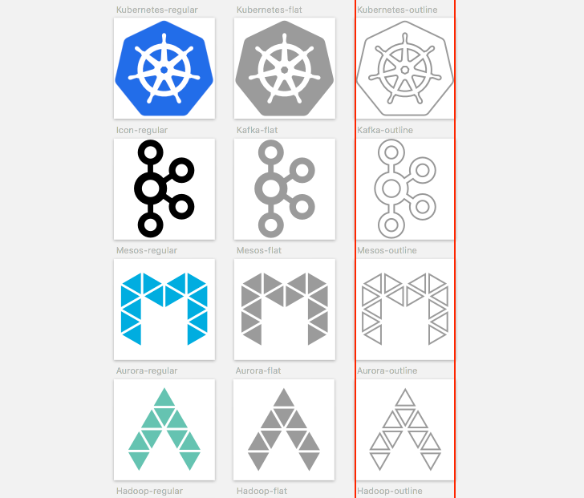

# Tech font
Sketch template with graphical assets and logotypes of cool open-source technologies. Made by [Jonas Bröms](https://twitter.com/jonasbroms).

## Table of contents
* [File formats](#file-formats)
* [Different weights](#different-weights)
* [Included Technologies](#included-technologies)
* [Overall Structure](#overall-structure)
* [What's new](#whats-new)
* [Future improvements](#future-improvements)
* [Versioning](#versioning)
* [Creator](#creator)
* [Contributer](#contributer)
* [Special thanks to](#special-thanks-to)
* [Copyright and license](#copyright-and-license)
* [Disclaimer](#disclaimer)

## File formats
Following file formats will be included within this template when released:
* Sketch file
* Installable font (.eot, .ttf, .woff)
* SVG files
* SVG sprite file
* PNG files (Sizes: 32x32, 48x48, 64x64, 128x128, 256x256, 512x512)
* Documentation (README.md)

## Different weights
* Regular (original)
* Flat
* Outline
* (Later, alternative)

## Included Technologies
* [Kubernetes]()
* [Kafka]()
* [Mesos]()
* [Aurora]()
* [Hadoop]()
* [Elasticsearch]()
* [Apache]()
* [Casandra]()
* [Docker]()
* [Hive]()
* [Hbase]()
* [Javascript]()
* [Nodejs]()
* [Java]()
* [Solr]()
* [Sqoop]()
* [Vagrant]()
* [Loopback]()
* [PHP]()
* [Lucene]()
* [JSON]()
* [ES6]()
* [ESlint]()
* [HTML5]()
* [CSS3]()
* [RabbitMQ]()
* [Sass]()
* [less]()
* [Nginx]()
* [Steroids]()
* [Bourbon]()
* [Sencha]()
* [Python]()
* [React]()
* [React-router]()
* [NPM]()
* [Firebase]()
* [uiKit]()
* [Nodewebkit]()
* [oauth]()
* [Backbone]()
* [MongoDB]()
* [Scala]()
* [Grunt]()
* [Gulp]()
* [Yeoman]()
* [Capistrano]()
* [Ruby]()
* [Bower]()
* [Browserify]()
* [Webpack]()
* [Coffeescript]()
* [Angular]()
* [Jade]()
* [LevelDB]()
* [Autoprefixer]()
* [Handlebars]()
* [Mithril]()
* [CoreOs]()
* [modernizr]()
* [Laravel]()
* [Webstorm]()
* [Perl]()
* [Mocha]()
* [Ember]()
* [Rails]()
* [Raphael]()
* [MySQL]()
* [PhoneGap]()
* [PhoneGap Robot]()
* [PostgreSQL]()
* [PHP Storm]()
* [Polymer]()
* [R-lang]()
* [Visual Studio]()
* [HTML5 boilerplate]()
* [Jenkins]()
* [Bootstrap]()
* [Flux]()
* [cakePHP]()
* [jQuery]()


## Overall Symbol Structure
```
Symbol/
└── Technologies/
    ├── Cool tech logo #1
    │   ├── Flat
    │   ├── Outline
    │   └── Regular
    ├── Cool tech logo #2
    └── Cool tech logo #3
```

```
Symbol/
└── Technologies/
    └── Cool tech logo #1
        ├── Slice of group below with exports
        └── Group
            ├── (Aa) Graphical asset
            ├── (/) Graphical asset
            └── ([]) Graphical asset
```

## Overall Shared Styles
```
Shared Styles/
└── Technologies/
    ├── Flat border inside
    ├── Flat border center
    ├── Flat border outside
    └── Flat fill
```

## What's new
* Every logotype / icon is made into a symbol
* Symbol Structure within Sketch for easier access
* Brand colors (as shared styles)
* All shared styles have a structure
* Documentation

## Bugs


## Future improvements
* Make more extensive work on flat and outlines graphical assets
* Better structure and categories
* Make optimizations to the whole framework
* Make it more lightweight so it runs smoother

## Versioning
0.1 Alpha

## Creator
**Jonas Bröms**
* [Twitter](https://twitter.com/jonasbroms)
* [GitHub](https://github.com/bromso)

## Contributer

## Special thanks to:
* [SvgPorn](http://svgporn.com/)
* [IcoMoon](https://icomoon.io/app/)

## Copyright and license
Graphical assets, files, code and documentation released under the [MIT](https://). Docs released under [Creative Commons](https://).

## Disclaimer
While I have redrawn and shared these assets for the benefit of the design community, I do not own any of the underlying products, logotype or user interface designs. By accessing these assets, you agree to obtain all necessary permissions from the underlying rights holders and/or adhere to any applicable brand use guidelines before using them. I disclaims all express or implied warranties with respect to these assets, including non-infringement of intellectual property rights.
